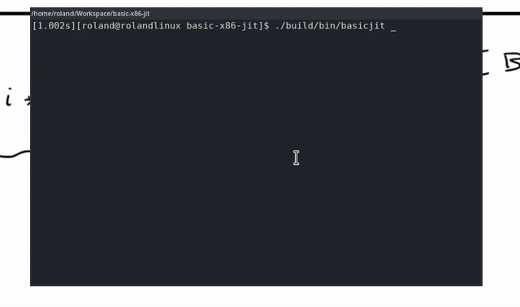

JIT compiler for BASIC
======================
This is a small JIT compiler for a version of the BASIC programming language, running on the x86-64 or 64-bit ARM (aarch64) architecture.

## About
### Features
This is a relatively _basic_ version of BASIC, but it has some interesting features.
* Variable names can have any length and are case sensitive
* Variable names can include keywords if they also contain other characters
* Labels can be used instead of line numbers
* There is support for 64bit integers, double-precision floats, strings and booleans
* Being a JIT compiler the execution is relatively fast (There is some compilation overhead)
* The JIT supports calling out to simple native functions

### Limitations
This implementation of the BASIC programming language has multiple limitations, not present in some others.
* It doesn't have any runtime errors
    * Array buffer overflows are not checked
    * There is no buffer overflow detection on `READ`
    * There is no type check on `READ`
    * There is no integer overflow detection
    * ...
* Array elements can't be used as a `FOR`-loop counter variable
* Array dimentions must be constant
* When loading files, lines will not be sorted by number

## Building from source
```
git clone https://github.com/rolandbernard/basic-jit
cd basic-jit
make BUILD=release
./build/release/bin/basicjit
```

## Hello world
The classic "Hello world"-program for basic works just fine:
```
10  Print "Hello world!"
20  Goto 10
```

